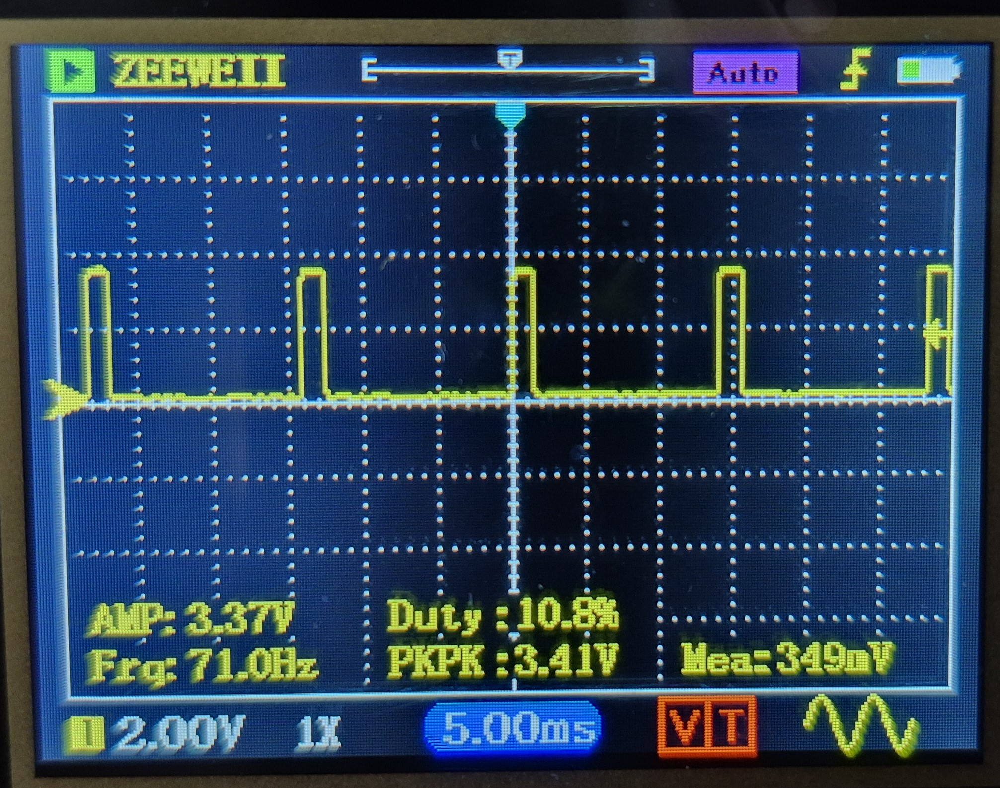

# BeagleCar
Term project for CMPT433

Equipment:
- BeagleBone Y-AI
- Logitech C270 720p webcam


Contents:
- [Dependencies](#dependencies)
  - [webServer](#webserver)
  - [webcam](#webcam)
  - [lcd/video streaming](#lcdvideo-streaming)
  - [udp terminal send testing](#udp-terminal-send-testing)
- [Wi-Fi Setup](#wi-fi-setup)
  - [Client](#client)
  - [AP](#ap)
- [WebServer](#web-server)
- [Manually Running CMake](#manually-running-cmake)
- [LCD config](#lcd-config)
- [udp program](#udp-program)


### Dependencies
#### webServer
    - g++ for compiling C++ and cross compiling
    ```bash
    (host)$ sudo apt install g++
    (host)$ sudo apt install g++-aarch64-linux-gnu
    ```
    - ffmpeg for video segmenting
    ```bash
    (host)$ sudo apt install ffmpeg
    (byai)$ sudo apt install ffmpeg
    ```
#### webcam
    1) openCV
    ```bash
    (target)$ sudo apt-get install libv4l-dev
    (target)$ sudo apt-get install libopencv-dev
    (target)$ sudo apt-get install ffmpeg
    ```
    2) compile code
    ```bash
    (host)$ make
    (host)$ make install
    ```

    3) VLC (to view video on host)
    ```bash
    (host) $ sudo apt install vlc
    ```
    4) run on target
     ```bash
    (target) $ ./capture_exec -F -o -c0 | ffmpeg -i pipe:0 -vcodec copy -f mjpeg udp://192.168.7.1:1234
    ```

    4.5) if 4 doesn't work ('pipe:0: Invalid data found when processing input'),
    first check where usb webcam shows up:


     ```bash
    (target) v4l2-ctl --list-devices
    ```

   then replace (/dev/video/_) with where the webcam is recognized (ex. video1/video2/video3)

   ```bash
   (target) $ ./capture_exec -F -o -c0 -d /dev/video_ | ffmpeg -i pipe:0 -vcodec copy -f mjpeg udp://192.168.7.1:1234
   ```

    5) Open VLC, click ‘Media – Open Network Stream’, set the network URL
    ‘udp://@:1234’, and click the play button. Then, the VLC will show the video
    stream.

#### lcd/video streaming
    ```sh
        (host) sudo apt-get install libavcodec-dev
        (host) sudo apt-get install libavformat-dev
        (host) sudo apt-get install libswscale-dev
        (host) sudo apt-get install libavutil-dev

        (target)$ sudo apt-get install ffmpeg
        (target)$ sudo apt install liblgpio-dev
    ```

#### udp terminal send testing
    ```sh
        (host) sudo apt-get install libncurses5-dev
    ```


- vidStreamer
    - Install ffmpeg on BeagleY-AI
    ```bash
    (target)$ sudo apt update
    (target)$ sudo apt-get install ffmpeg
    ```
    Troubleshooting:
    - If the update command fails, it can prevent installation of necessary dependencies. 
    To fix this, ensure the system time is correct
    ```bash
    # Check system time
    (target)$ date
    # Correct system time
    (target)$ sudo date -s 'YYYY-MM-DD HH:MM:SS'
    # Check the corrected time
    (target)$ date
    ```
    - Install ffmpeg development libraries on host and target
    ```bash
    (host)$ sudo apt-get install libavformat-dev libavcodec-dev libavutil-dev libswscale-dev libavdevice-dev libavfilter-dev
    (target)$ sudo apt-get install libavformat-dev libavcodec-dev libavutil-dev libswscale-dev libavdevice-dev libavfilter-dev
    ```
    - Install arm64 versions ffmpeg development libraries on host and target
    ```bash
    (host)$ sudo dpkg --add-architecture arm64
    (host)$ sudo apt-get install libavformat-dev libavcodec-dev libavutil-dev libswscale-dev libavdevice-dev libavfilter-dev
    ```
    Troubleshooting:
    - Program will not cross-compile if the arm64 libraries are not in the specified location
    To fix this, check install locations and move if necessary
    ```bash
    # Check if libraries have been installed
    (host)$ sudo apt list libavcodec-dev
    # Result should be something like "libavcodec-dev/stable,stable-security,now 7:5.1.6-0+deb12u1 arm64 [installed]"
    # Find locations of packages
    (target)$ dpkg -L libavcodec-dev:arm64
    # Result should contain "/usr/include/aarch64-linux-gnu/libavcodec" and "/usr/lib/aarch64-linux-gnu"
    # Otherwise, update the vidStreamer-level CMakeLists.txt with the correct directories for /include and /lib directories of cross compiler
    ```
    <!-- not sure if needed -->
    <!-- - Install pkg-config on host and target (required for CMake to configure libraries during build)
    ```bash
    (host)$ sudo apt-get install pkg-config
    (target)$ sudo apt-get install pkg-config
    ``` -->


## Wi-Fi setup
### Client
#### Method 1 (wpa_supplicant):
```
(target)$ sudo apt-get install wpasupplicant
```
set `/etc/wpa_supplicant/wpa_supplicant.conf` to (update ssid and password):
```
ctrl_interface=DIR=/var/run/wpa_supplicant GROUP=netdev
update_config=1
country=US
network={
ssid="TEST"
psk="testing123"
}
```
Everytime on reboot/boot:
```sh
(target)$ sudo killall wpa_supplicant
(target)$ sudo wpa_supplicant -B -i wlan0 -c /etc/wpa_supplicant/wpa_supplicant.conf
(target)$ sudo dhclient wlan0
(target)$ sudo ifconfig wlan0 up
```

#### Method 2 (Network Manager):
Doesnt seem to give wlan0 an address. Unsure if this will cause issues
```sh
(target)$ sudo apt-get install network-manager
(target)$ sudo nmcli d wifi connect wifi_ssid password wifi_password
```

### AP

```sh
(target)$ sudo apt-get install hostapd
(target)$ sudo apt-get install isc-dhcp-server
```
uncomment and set in `/etc/default/hostapd`:
```
DAEMON_CONF="/etc/hostapd/  .conf"
```
set `/etc/hostapd/hostapd.conf` to (update ssid and wpa_passphrase):
```
interface=wlan0
channel=6
ieee80211n=1
hw_mode=g
ssid=TEST
wpa=2
wpa_passphrase=testing123
wpa_key_mgmt=WPA-PSK
rsn_pairwise=CCMP
wpa_pairwise=TKIP
auth_algs=1
```

add to `/etc/dhcp/dhcpd.conf` (make sure static wlan0 IP matches routers/subnet):
```sh
ddns-update-style none;
authoritative;

subnet 192.168.10.0 netmask 255.255.255.0 {
    range 192.168.10.5 192.168.10.8;
    option routers 192.168.10.1;
    option subnet-mask 255.255.255.0;
}
```
To increase lease time (seconds), adjust `default-lease-time` and `max-lease-time`.

To increase number of clients that can connect at once, change `range`

Everytime on re/boot:
```sh
# start access point
(target)$ sudo /etc/init.d/hostapd start
# start dns server
(target)$ sudo service isc-dhcp-server start
# set wlan0 static ip
(target)$ sudo ip addr add 192.168.10.1/24 dev wlan0
```

### Testing Connectivity
Connect two devices to the AP and figure out their IPs. (Look on the device or check `/var/lib/dhcpd/dhcpd.leases` on the AP)
```
(device 1)$ ping (AP IP)
(device 1)$ ping (device 2 IP)
```
**NOTE** pinging a device may not work if yu have firewalls. Pinging between BYAIs should work unless you've configured a firewall.


### Troubleshooting
DHCP:
- `service isc-dhcp-server status` to see dhcp status
- `service isc-dhcp-server stop` to stop dhcp
- `dhcpd -t -cf /etc/dhcp/dhcpd.conf` to check dhcp config file has no issues

hostapd/AP config:
- `sudo iw list` to check that hardware supports AP interface mode
- `sudo rfkill list` to check if Wi-fi is blocked
- `sudo rfkill unblock device_name_from_rfkill_list` to unblock soft block
- `sudo service network-manager restart`
- `sudo hostapd -d /etc/hostapd/hostapd.conf` to see errors from hostapd when starting it
- make sure hostapd is stopped before starting it:
```sh
ps ax | grep hostapd
# if the previous command outputted something:
sudo /etc/init.d/hostapd stop
```
- restart wi-fi
```sh
sudo nmcli radio wifi off
sudo nmcli radio wifi on
```
General Networking:
- `ifconfig` to check correct IP address and wlan0 is up
- `route -n` to check routing rules
- `sudo iptables -L` to check firewall
- `sudo tcpdump -i wlan0` to check packets on interface


### Web Server
- You can run the example server after building by doing the following:
```bash
$ cd build/testing/
$ ./webserverTest
```
From there you can go to the following addresses:
- 0.0.0.0:8080
- 0.0.0.0:8080/template/<some integer value>
- 0.0.0.0:8080/template_file/<some integer value>
- 0.0.0.0:8080/load_file
- 0.0.0.0:8080/static/websocket_page.html
- 0.0.0.0:8080/static/websocket_video.html

*For the websocket examples you should see the websocket messages both in the terminal log and in the console log on the webpage.

- Other requirments:
    - The templates and static directories need to be in the location where the executable is being ran.
    - Websocket streaming only verified to work on chrome
    - ffmpeg command to reincode a video and keyframes every 50 frames so it can be segmented to 2 second chunks.... kindly provided by chatgpt; Sample video from: https://www.sample-videos.com/
    ```bash
    $ ffmpeg -i input.mp4 -c:v libx264 -g 50 -keyint_min 50 -sc_threshold 0 -f segment -segment_time 2 output%03d.mp4
    ```
    - ffmpeg command to fragment each of the outputs; there is a shell script in the video directory to do both of the commands automatically.
    ```bash
    $ ffmpeg -i non_fragmented.mp4 -movflags frag_keyframe+empty_moov+default_base_moof fragmented.mp4
    ```


## Manually Running CMake

To manually run CMake from the command line use:

```shell
  # Regenerate build/ folder and makefiles:
  rm -rf build/         # Wipes temporary build folder
  cmake -S . -B build   # Generate makefiles in build\

  # Build (compile & link) the project
  cmake --build build
```

## Running on Target

### LCD config:

* Load the SPI Overlay on the board (just do once)
  a. Edit config file:
     `(byai)$ sudo nano /boot/firmware/extlinux/extlinux.conf`
  b. Edit the last section to make it say:
     ```
      label microSD (default)
          kernel /Image
          append console=ttyS2,115200n8 root=/dev/mmcblk1p3 ro rootfstype=ext4 resume=/dev/mmcblk1p2 rootwait net.ifnames=0 quiet
          fdtdir /
          fdt /ti/k3-am67a-beagley-ai.dtb
          fdtoverlays /overlays/k3-am67a-beagley-ai-spidev0.dtbo
          initrd /initrd.img
     ```
     (If you are also enabling PWM, make the `fdtoverlays` line be a space-separated list of .dtbo files.)
  c. Reboot.
* At each boot you'll need to either:
  a. Change the SPI to be usable by anyone:
     `sudo chmod a+rw /dev/spidev0.*`
  b. Run the program with root access.

* [OPTIONAL] The LCD is limited to 1fps by default; increase the frame rate by following the steps from [this guide](https://github.com/wcs3/BYAI-mcu_spi0/tree/main)


### udp program
To run receiver:
```sh
(target or host) $ ./udp
```

To run sender with hardware inputs: (joystick, rotary encoder)
```sh
(target) $ ./udp --sender
# q to quit
```
To run sender on terminal with keyboard inputs (w/a/s/d=joystick, j/l=encoder, e=encoder push, space=joystick push)
```sh
(target or host) $ ./udp --sender --terminal
# q to quit
```
If you want to run the terminal sender without ncurses:
- change `getch()` to `getchar()` in `app/src/main.c`
- comment out the dependency in `app/CMakeLists.txt`

Sender/receiver IP addresses can be changed in `app/include/udp_constants.h`


## Motor and Servo Control
 - The motor expects a 71hz signal with the duty cycle for neutral being 1549us, full reverse being 1296us and full forward being 1789us. 
 - The servo expects 50hz though may accept outside of those bounds and goes from 1ms to 2ms from one side to the other. 
 - Both require a pwm signal. Currently the motor uses gpiopin 15 which is the right most uart pin when the uart header is on the top left of the board when looked at from above.
